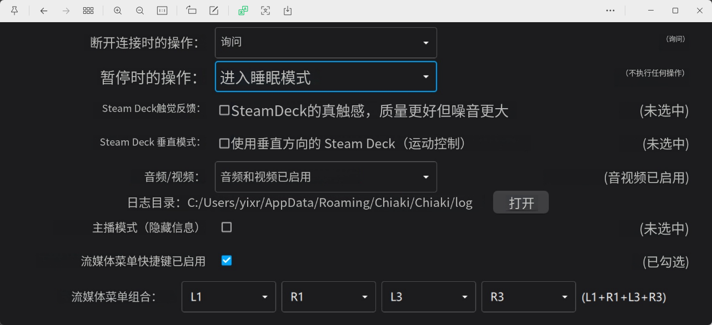
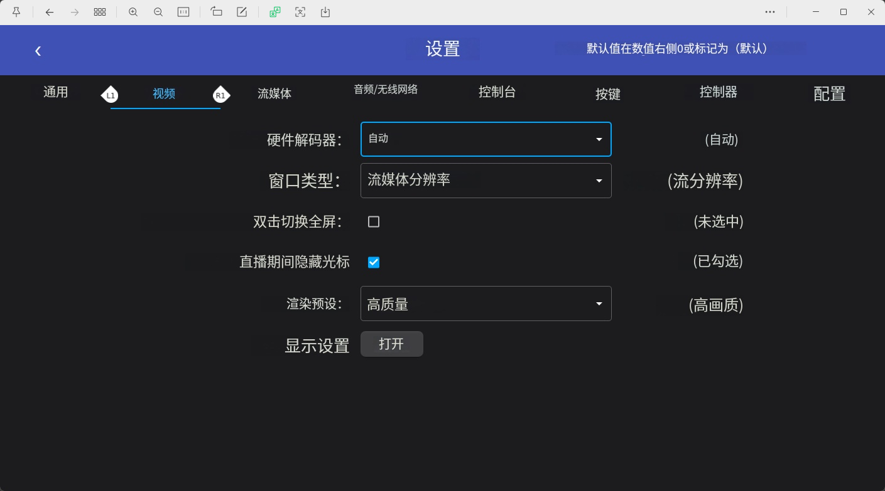
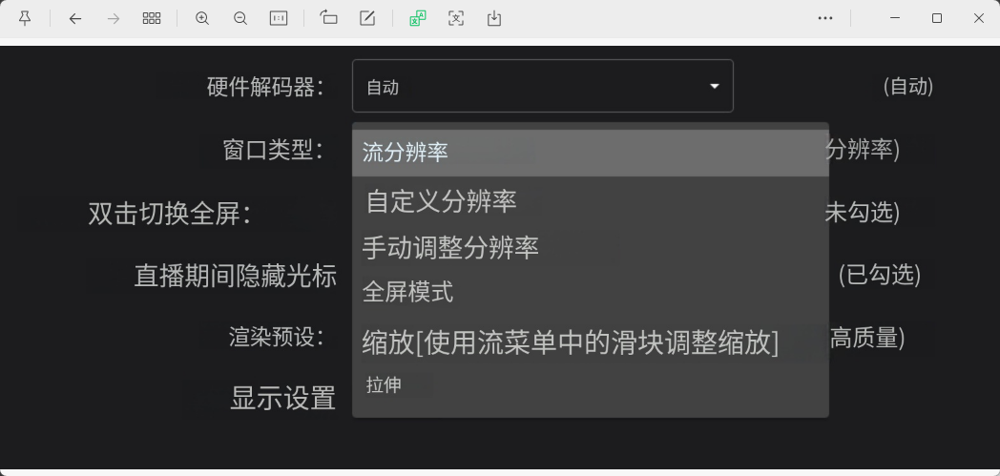
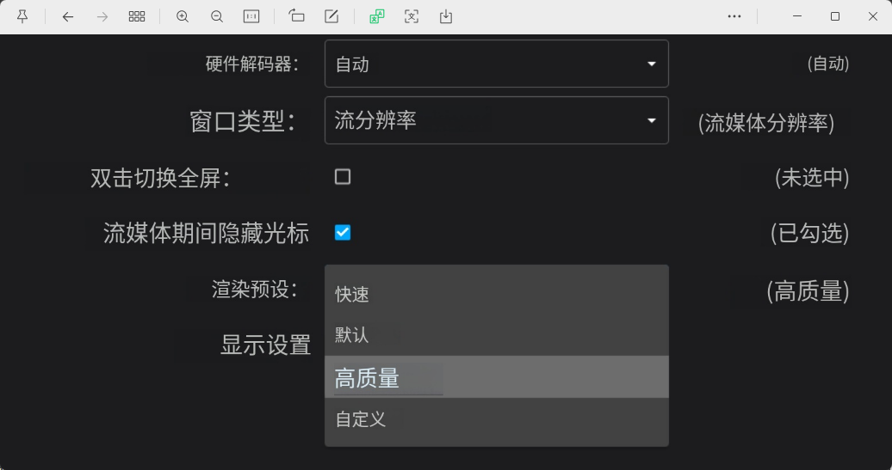
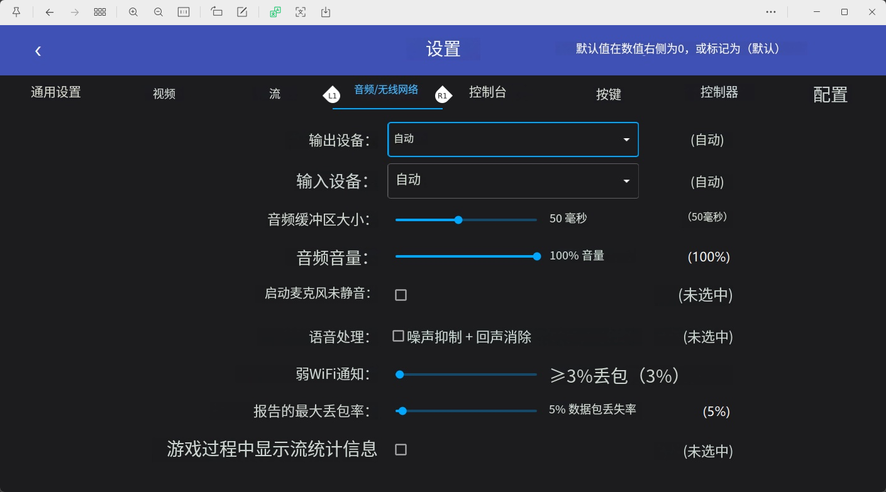
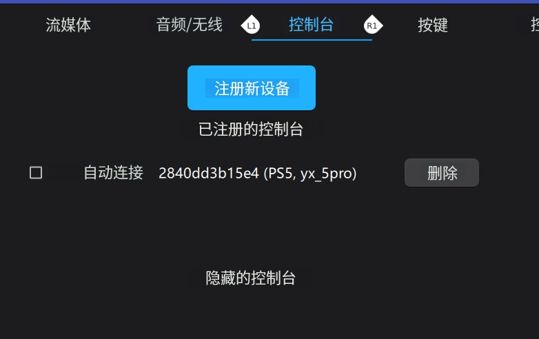
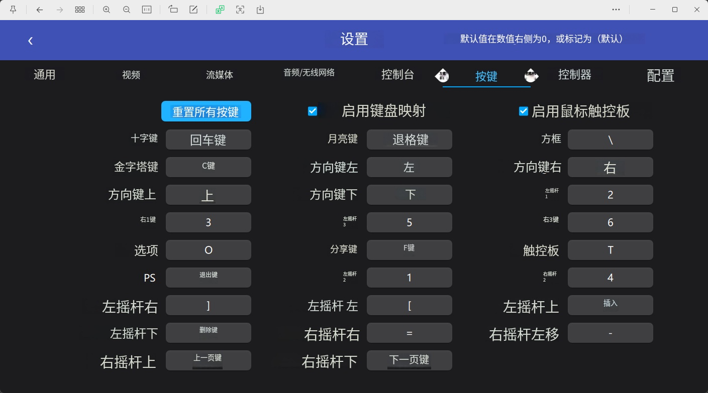
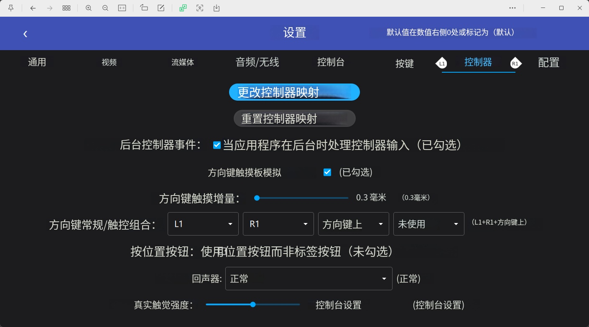
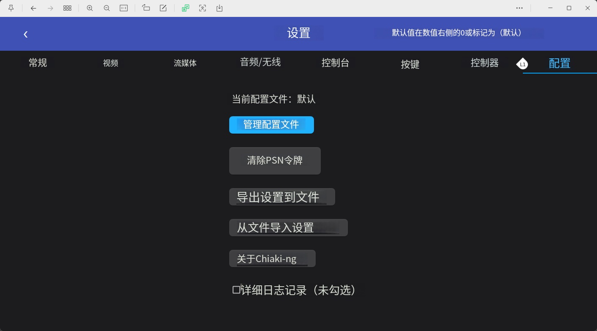
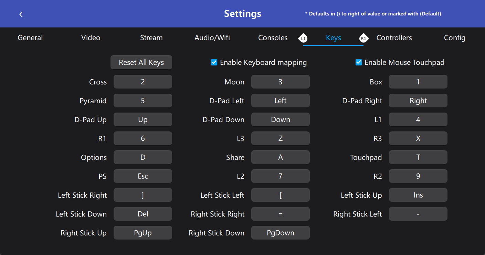

## 基于本地网络状况,经iperf3 -u -b 0 及 -R 测试,最佳远程带宽为45M
---
# Chiaki 设置说明（按截图整理）

> 说明：`img/1.png` ~ `img/9.png` 为设置项截图；你提到的第 10 张自定义键位，目录里对应文件为 `img/11.png`，已按该图整理。

## 1) 通用（`img/1.png`）

- 断开连接时的操作：询问
- 暂停时的操作：不执行任何操作
- Steam Deck 触觉反馈：关闭（未选中）
- Steam Deck 垂直模式：关闭（未选中）
- 音频/视频：音频和视频已启用
- 日志目录：`C:/Users/yixr/AppData/Roaming/Chiaki/Chiaki/log`
- 主播模式（隐藏信息）：关闭（未选中）
- 流媒体菜单快捷键：启用（已勾选）
- 流媒体菜单组合：`L1 + R1 + L3 + R3`

## 2) 视频（`img/2.png`）

- 硬件解码器：自动
- 窗口类型：流媒体分辨率
- 双击切换全屏：关闭（未选中）
- 串流期间隐藏光标：开启（已勾选）
- 渲染预设：高质量
- 显示设置：可通过“打开”进入系统显示设置

## 3) 窗口类型可选项（`img/3.png`）

- 流分辨率
- 自定义分辨率
- 手动调整分辨率
- 全屏模式
- 缩放（使用流菜单中的滑块调整缩放）
- 拉伸

## 4) 渲染预设可选项（`img/4.png`）

- 快速
- 默认
- 高质量
- 自定义

## 5) 音频 / 无线网络（`img/5.png`）

- 输出设备：自动
- 输入设备：自动
- 音频缓冲区大小：50 ms
- 音频音量：100%
- 启动麦克风未静音：关闭（未选中）
- 语音处理（噪声抑制 + 回声消除）：关闭（未选中）
- 弱 WiFi 通知阈值：丢包 > 3%
- 报告的最大丢包率：5%
- 游戏过程中显示流统计信息：关闭（未选中）

## 6) 控制台（`img/6.png`）

- 可注册新设备
- 已注册控制台示例：`2840dd3b15e4 (PS5, yx_5pro)`
- 自动连接：当前未勾选
- 支持删除已注册控制台
- 有“隐藏的控制台”区域

## 7) 按键（`img/7.png`）

- 支持“重置所有按键”
- 启用键盘映射：已开启
- 启用鼠标触控板：已开启
- 当前界面展示了键盘/鼠标到手柄按键的映射设置

## 8) 控制器（`img/8.png`）

- 可更改/重置控制器映射
- 应用在后台时仍处理控制器输入：已启用
- 方向键触摸板模拟：已启用
- 方向键触摸增量：0.3 mm
- 方向键常规/触控组合：`L1 + R1 + 方向键上 + 未使用`
- 按位置按钮（使用位置按钮而非标签按钮）：未启用
- 回声器：正常
- 真实触觉强度：控制台设置

## 9) 配置（`img/9.png`）

- 当前配置文件：默认
- 管理配置文件
- 清除 PSN 令牌
- 导出设置到文件
- 从文件导入设置
- 关于 Chiaki-ng
- 详细日志记录：关闭（未勾选）

## 10) 自定义键位

> 对应截图文件：`img/11.png`

| 手柄按键 | 键盘映射 |
|---|---|
| Cross（叉） | `2` |
| Pyramid（三角） | `5` |
| D-Pad Up（方向键上） | `Up` |
| R1 | `6` |
| Options | `D` |
| PS | `Esc` |
| Left Stick Right（左摇杆右） | `J` |
| Left Stick Down（左摇杆下） | `Del` |
| Right Stick Up（右摇杆上） | `PgUp` |
| Moon（圆） | `3` |
| D-Pad Left（方向键左） | `Left` |
| D-Pad Down（方向键下） | `Down` |
| L3 | `Z` |
| Share | `A` |
| L2 | `7` |
| Left Stick Left（左摇杆左） | `[` |
| Right Stick Right（右摇杆右） | `=` |
| Right Stick Down（右摇杆下） | `PgDown` |
| Box（方块） | `1` |
| D-Pad Right（方向键右） | `Right` |
| L1 | `4` |
| R3 | `X` |
| Touchpad（触摸板） | `T` |
| R2 | `9` |
| Left Stick Up（左摇杆上） | `Ins` |
| Right Stick Left（右摇杆左） | `-` |

